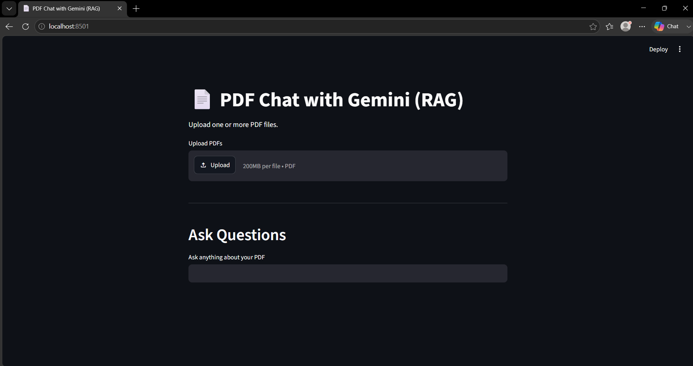
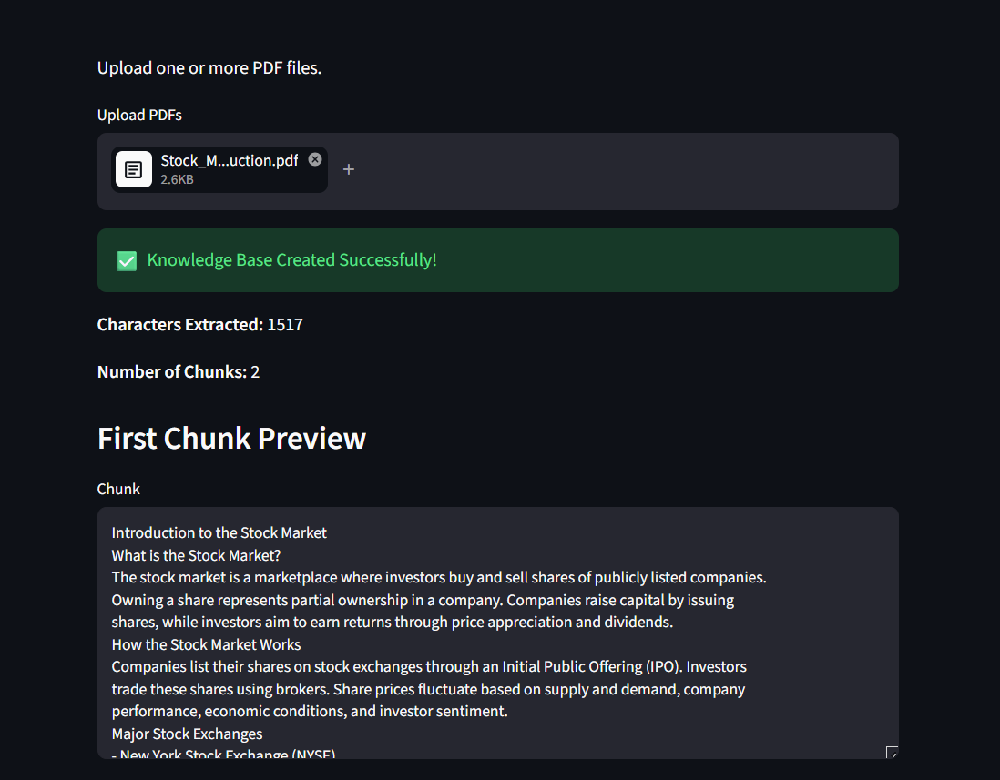
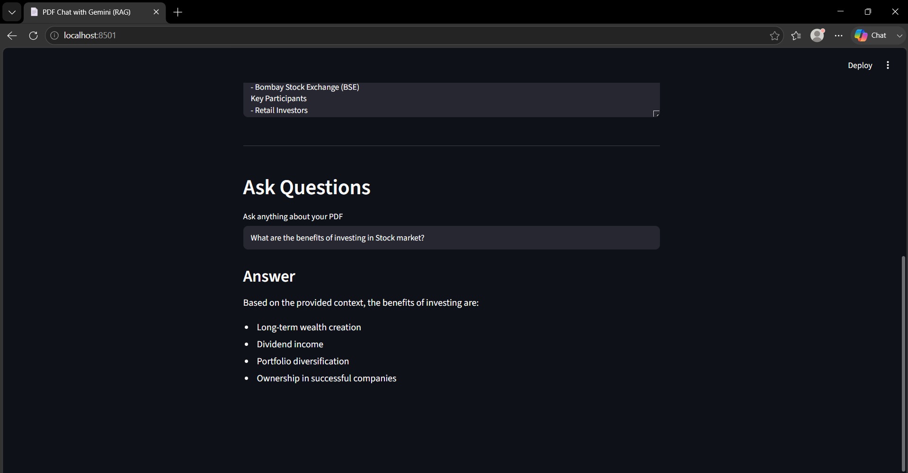

# PDF Chat with Gemini (RAG)

## Overview

PDF Chat with Gemini is a Retrieval-Augmented Generation (RAG) application that enables users to upload one or more PDF documents and ask questions based on their content. The application retrieves the most relevant information from the uploaded documents using semantic search and generates context-aware responses using Google's Gemini model.

## Features

* Upload and process one or more PDF documents
* Extract text from PDF files
* Split text into semantic chunks
* Generate vector embeddings using Gemini Embeddings
* Store embeddings in ChromaDB
* Perform semantic similarity search
* Generate answers using the Gemini API
* Interactive web interface built with Streamlit

## Technology Stack

* Python
* Streamlit
* Google Gemini API
* LangChain
* ChromaDB
* PyPDF
* Python Dotenv

## Project Structure

```text
PDF-RAG-Chatbot/
│
├── app.py
├── utils.py
├── requirements.txt
├── README.md
├── .gitignore
├── .env
└── chroma_db/
```

## Installation

### Clone the repository

```bash
git clone https://github.com/geethameenakshiramireddy/PDF-RAG-Chatbot.git
```

### Navigate to the project directory

```bash
cd PDF-RAG-Chatbot
```

### Create a virtual environment

Windows

```bash
python -m venv venv
venv\Scripts\activate
```

Linux/macOS

```bash
python3 -m venv venv
source venv/bin/activate
```

### Install dependencies

```bash
pip install -r requirements.txt
```

### Configure the environment

Create a `.env` file in the project directory and add your Gemini API key.

```env
GOOGLE_API_KEY=YOUR_API_KEY
```

### Run the application

```bash
streamlit run app.py
```

## Application Workflow

1. Upload one or more PDF documents.
2. Extract text from the uploaded files.
3. Split the extracted text into smaller chunks.
4. Generate embeddings for each chunk.
5. Store the embeddings in ChromaDB.
6. Accept a user query.
7. Retrieve the most relevant document chunks using semantic search.
8. Generate a response using Gemini based on the retrieved context.

## Architecture

```text
PDF Upload
     │
     ▼
Text Extraction
     │
     ▼
Text Chunking
     │
     ▼
Gemini Embeddings
     │
     ▼
ChromaDB Vector Store
     │
     ▼
User Query
     │
     ▼
Similarity Search
     │
     ▼
Relevant Context
     │
     ▼
Gemini
     │
     ▼
Generated Response
```

## Screenshots

### Home Page



### Upload PDF




### Ask Question


